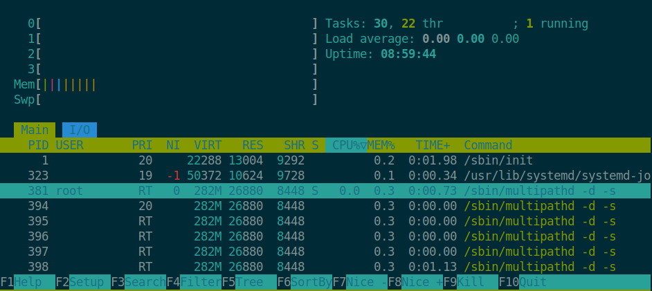

## Threading and Parallel processing module

This module will be run in class to demonstrate and discuss the basics of multithreading and parallel processing in Python.

The `threading` and `multiprocessing` standard Python modules will be used.

To illustrate the effect of Python Global Interpreter Lock (GIL) and its changes, a recent (`>= 3.12`) and possibly also an older (`<=3.9`) Python versions should be used.

To install older Python versions on a Debian-like Linux OS (e.g. Ubuntu), once can do the following:
```bash
# include a remote repository for older python versions
sudo add-apt-repository ppa:deadsnakes/ppa;
# update the list of packages
sudo apt update;
# install a specific python version (e.g. 3.7)
sudo apt install python3.7
```

The impact of threading and multiprocessing on the CPU resources will be monitored using `htop` (cross-platform interactive process viewer availabe by default in Ubuntu).



The `taskset` Unix command can be used to set the affinity of a task to a given CPU or range of CPUs, to pin threads or processes to one or more CPU cores.
```bash
# execute on CPUs 1 and 3 only
taskset -c 1,3 python3.7 python_script.py
```

### Pre-requisites

1. Clone this repo (or fetch the latest updates) 
2. Have a working environment with one or more Python3 interpreters (also `docker`, `venv`, `conda`, etc can be used).
