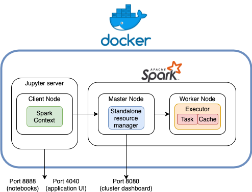
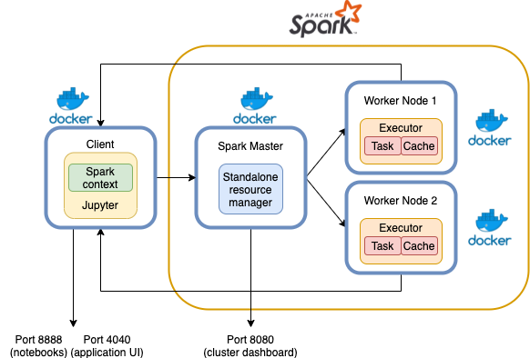

# MAPD-B

Lectures for Management and Analysis of Physics Datasets course MSc in Physic of Data at University of Padua 2021-2022.

## Docker

All exercises can be run using Docker.

In this way, the only thing you need to install is docker itself (instructions for Mac, Windows and linux can be found [here](https://docs.docker.com/get-docker/)).

You can choose to run it in **two ways**: 
1. Using a _single container_, simulating the set up for a "local cluster"
2. Using `docker-compose` to simulate the behaviour of a real N-machine cluster, where master and workers will be on different nodes

### 1. Single container

Run the following command, from inside `MAPD-B/spark` directory, to create a container with Spark and Jupyter already installed.
The first time you run it may take a while because it needs to download all the necessary components and libraries from DockerHub.
However, the next times you will need this container it will be created instantly since all the components are cached.

You will need to open up and forward the ports 8080, 8888, 4040.
You will also need to mount as a volume the local folder onto the container path `/opt/workspace`.

```
docker run --rm -it \
        -p 8888:8888 \
        -p 4040:4040 \
        -p 8080:8080 \
        -v $PWD:/opt/workspace \
        jpazzini/mapd-b:spark-jupyter
```

Once it has been created, you can connect to Jupyter from your local browser by typing `localhost:8888`. 
Make sure that other Jupyter-Notebooks are not already using this port. 

Test if everything is working with the notebook `notebooks/docker/Docker.ipynb`



### 2. Docker cluster

We can simulate multiple nodes by using multiple Docker containers.

Have a look at the `docker-compose.yml` file to see how the system is set up.

- A container hosting the Jupyter-Notebook server, acting as the client from which we will deploy applications to the Spark cluster 
- A container running as the Spark Master with the Cluster Resource Manager
- A number of additional containers, one per each Spark worker we want to create



This cluster can be spawned with 

```
docker-compose up
```

By default, only one worker is created, each worker with 1 core and 512 MB of memory.
If you want to use an arbitrary number **N** of workers, you can scale the cluster with:

```
docker-compose up --scale spark-worker=N
```

Again, after the cluster has been created you can navigate to `localhost:8888` to open the Jupyter dashboard. 

In this case the Spark master has already been created, you don't need to start it manually. 
Indeed the Spark cluster dashboard will be already available on `localhost:8080`. 
See the example notebook on `notebooks/docker/Docker-Cluster.ipynb`.

If you want to use more resources per each worker, edit the file `docker-compose.yml` and change `SPARK_WORKER_CORES` and `SPARK_WORKER_MEMORY` to the value you prefer. 


The cluster can be shut down by typing
```
docker-compose down
```

## Local cluster

As an alternative, you can install and use Spark directly from your local machine, or from a virtual machine you may have created.

The Spark binaries can be downloaded from the [link](https://spark.apache.org/downloads.html).
Please read carefully the instructions provided in the dedicated [page](https://spark.apache.org/docs/latest/).
To run locally, Spark also requires to have Java (version 8 or version 11) installed in your system.

Please note that in this case, the teacher and the teaching assistants will not provide any support for your private installations.

It is therefore strongly suggested to use either the Docker Cluster or Single Docker Container deployment of Spark to run the hands-on sessions.

## Lecture 1

* Creation of a Spark standalone cluster
* Basic commands (parallelize, map, reduce, ...)
* Spark application WebUI
* Word count, computing $\pi$ and distributed gradient descent

## Lecture 2

* Spark dataframe
* Basic dataframe operations
* UDF and PandasUDF

## Lecture 3

* Spark Streaming
* Streaming from TCP Socket
* Dataframes in spark streaming
