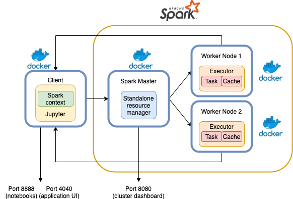

## PySpark module

### Docker

All exercises are to be run using Docker.

In this way, the only thing you need to install is `docker` itself (instructions for Mac, Windows and Linux can be found [here](https://docs.docker.com/get-docker/)).

For this exercise, we will use `docker compose` to simulate a system with a number of nodes: 
- 1 **Spark master node** (the head-node of the cluster) with the Cluster Resource Manager
- 1 _or more_ **Spark worker(s) node** (the processing-nodes of the cluster)
- 1 service running the **Spark client, the Python interpreter and a Jupyter-notebook**



While this setup may seem excessive, it can be useful to understand and test a container-based environment with multiple active services. 
The client-jupyter container is, in fact, superfluous, as you could use your local machine to run these services, after installing all libraries and modules required to run the `pySpark` client. 

Refer to the `docker-compose.yml` file for details on the system setup.

All docker images used in this setup will be pulled from the [remote Docker registry](https://hub.docker.com/repository/docker/jpazzini/mapd-b).

## Docker compose

All services can be spawned with 

```
docker compose up
```

By default, only **one worker is created**, with **1 core** and **512 MB of memory**.

If you want to use an arbitrary number **N** of workers, you can scale the cluster with

```
docker compose up --scale spark-worker=N
```

Using the port forwarding from the docker-compose yml, we expose the Jupyter-notebook service on the port 1234 (you can change the port, if you so prefer).

By pointing your browser to `localhost:1234` you will see a Jupyter service running.

The Spark `master` service is created at the start of the `docker-compose`, and a port mapping has been enabled to ensure you can reach its dashboard from your host machine. 

The Spark cluster dashboard will be available on `localhost:8080`.

If you want to fine tune your cluster, for example by allocating more resources per each worker, you can edit the `docker-compose.yml` file and change the `SPARK_WORKER_CORES` and `SPARK_WORKER_MEMORY` values to what you prefer. 


### Shutting down the Docker compose "cluster"

The services can be stopped with an interrupt from the terminal (`CTRL+c`), or issuing the stop of the containers from a second terminal.

The cluster can be finally shut down by typing

```
docker compose down
```

### Pre-requisites

1. Clone this repo (or fetch the latest updates) 
2. Test that the `docker compose` can be started (`up`) and stopped (`down`) succesfully 

## Lecture 1

* Connection to a Spark cluster
* Basic commands (`parallelize`, `map`, `reduce`, ...)
* Spark application WebUI
* Word count, computing $\pi$ and distributed gradient descent

## Lecture 2

* Spark dataframe
* Basic dataframe operations
* UDFs and PandasUDFs

## Lecture 3

* Spark Structured Streaming
* Streaming from TCP Socket
* Distributed streaming processing 

